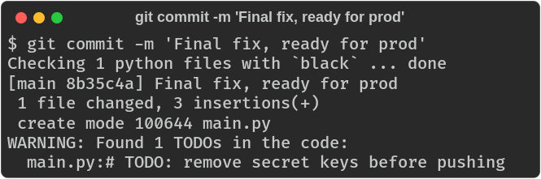

# git-wrapper

A custom git wrapper that runs pre/post-process plugins around git commands. Plugins can modify arguments, disable command execution, or react to git output.



## Installation

1. Clone the repo:
   ```bash
   git clone git@github.com:shitchell/git-wrapper.git
   ```

2. Add the wrapper to your PATH (before the system git):
   ```bash
   export PATH="/path/to/git-wrapper/bin:$PATH"
   ```

3. Create the plugin directories:
   ```bash
   mkdir -p ~/.git.d/{pre-process.d,post-process.d}
   ```

## Configuration

All options are set via `git config`:

| Option | Type | Default | Description |
|--------|------|---------|-------------|
| `wrapper.enabled` | bool | `true` | Enable/disable the wrapper entirely |
| `wrapper.scriptDir` | path | `~/.git.d` | Directory containing plugin scripts |
| `wrapper.showScriptName` | bool | `false` | Prefix plugin output with plugin name |
| `wrapper.exitOnFailure` | bool | `false` | Exit if a plugin fails |
| `wrapper.notifyOnModify` | bool | `false` | Show message when plugin sets `OUTPUT_MODIFIED=true` |
| `wrapper.verbose` | bool | `false` | Enable both `showScriptName` and `notifyOnModify` |

Example:
```bash
git config --global wrapper.verbose true
git config --global wrapper.exitOnFailure true
```

### Passthrough

Skip the wrapper entirely:
```bash
# Via environment variable
GIT_PASSTHROUGH=true git status

# Via config (useful for specific repos)
git config wrapper.enabled false
```

**Note:** `GIT_PASSTHROUGH` is checked at the very top of the script before anything else loads - it's the most efficient way to bypass the wrapper. `wrapper.enabled` requires the script to load functions, parse arguments, and read config before it can check the setting. Use `GIT_PASSTHROUGH` for performance-sensitive scenarios (e.g., scripts that call git repeatedly); use `wrapper.enabled` for convenience when you want to disable the wrapper for a specific repo via config.

## Plugin Configuration

Plugins use git config subsections for their settings:

```ini
[wrapper "plugin.commit_pyblack"]
    enabled = false
    mode = error

[wrapper "plugin.clone_organize_dirs"]
    basedir = ~/projects
```

Or via command line:
```bash
# Disable a plugin
git config wrapper.plugin.commit_pyblack.enabled false

# Set plugin options
git config wrapper.plugin.commit_pyblack.mode error
git config wrapper.plugin.clone_organize_dirs.basedir ~/projects
```

All plugins support `enabled` (default: `true`). Plugin-specific options are documented below.

## Writing Plugins

Plugins are bash scripts placed in `~/.git.d/pre-process.d/` or `~/.git.d/post-process.d/`.

### Naming Standards

- `{subcommand}.sh` - anonymous plugin for a subcommand (e.g., `commit.sh`)
- `{subcommand}_{name}.sh` - named plugin for a subcommand (e.g., `commit_lint.sh`)
- `{number}_{name}.sh` - runs for all subcommands, ordered by number (e.g., `10_log.sh`)

### Available Variables

Plugins are sourced (not executed), so they have access to:

| Variable | Description |
|----------|-------------|
| `GIT` | Path to the real git binary |
| `GIT_ARGS` | Array of git options (before subcommand) |
| `GIT_SUBCOMMAND` | The git subcommand (e.g., `commit`, `push`) |
| `GIT_SUBCOMMAND_ARGS` | Array of arguments after the subcommand |
| `GIT_EXIT_CODE` | Exit code from git (post-process only) |
| `RUN_GIT_CMD` | Set to `false` in pre-process to skip git execution |
| `OUTPUT_MODIFIED` | Set to `true` if plugin modified output |
| `USE_COLOR` | Whether color output is enabled |
| `_STDOUT_PIPED` | `true` if stdout is being piped |
| `_IN_SCRIPT` | `true` if git is being called from a script |
| `__PLUGIN_NAME` | Current plugin name (filename without `.sh`) |

### Helper Functions

| Function | Description |
|----------|-------------|
| `plugin-option [--bool\|--int] [--default VAL] KEY` | Read `wrapper.plugin.<plugin>.<key>` |
| `wrapper-option [--bool\|--int] [--default VAL] KEY` | Read `wrapper.<key>` |
| `git-option [--bool\|--int] [--default VAL] KEY` | Read any git config key |
| `debug MESSAGE` | Print debug message when `DEBUG=true` |

### Color Variables

When `USE_COLOR` is true, these are available:

```bash
$C_RED $C_GREEN $C_YELLOW $C_BLUE $C_MAGENTA $C_CYAN
$S_BOLD $S_DIM $S_RESET
```

### Example: Pre-process Plugin

```bash
#!/usr/bin/env bash
# ~/.git.d/pre-process.d/commit_secrets.sh
# Block commits containing potential secrets

patterns=(
    'AKIA[0-9A-Z]{16}'           # AWS access key
    '-----BEGIN .* PRIVATE KEY'  # Private keys
    'password\s*=\s*["\047][^"\047]+'  # password = "..."
)

staged=$("${GIT}" diff --cached --name-only)
for pattern in "${patterns[@]}"; do
    if "${GIT}" diff --cached | grep -qE "${pattern}"; then
        echo "error: staged changes may contain secrets (${pattern})" >&2
        RUN_GIT_CMD=false
        return 1
    fi
done
```

### Example: Post-process Plugin

```bash
#!/usr/bin/env bash
# ~/.git.d/post-process.d/push_notify.sh
# Send notification after push

if [[ ${GIT_EXIT_CODE} -eq 0 ]]; then
    notify-send "Git" "Push completed successfully"
fi
```

## Sample Plugins

The `plugins/` directory includes ready-to-use plugins. See [plugins/README.md](plugins/README.md) for details.

To use a plugin:
```bash
cp plugins/pre-process.d/commit_bashsyntaxcheck.sh ~/.git.d/pre-process.d/
```

| Plugin | Description |
|--------|-------------|
| `commit_bashsyntaxcheck.sh` | Validate bash syntax before commit |
| `commit_pyblack.sh` | Check Python formatting with black |
| `commit_claude.sh` | Set author/GPG for Claude Code sessions |
| `commit_noverify.sh` | Block `--no-verify` when strict mode enabled |
| `clone_organize_dirs.sh` | Organize repos by host/user/repo |
| `commit_todo_check.sh` | Warn about TODOs in committed code |
| `commit_wip_check.sh` | Check for WIP markers |
| `status_ignore_count.sh` | Show ignored file count |
| `push_jedi.sh` | Bless force pushes |


## Running Tests

Tests use [bats](https://github.com/bats-core/bats-core):

```bash
bats tests/git-wrapper.bats
```

## Exit Codes

| Code | Meaning |
|------|---------|
| 0 | Success |
| 1 | Git command failed |
| 2 | Pre-process plugin failed |
| 3 | Post-process plugin failed |

## License

MIT
