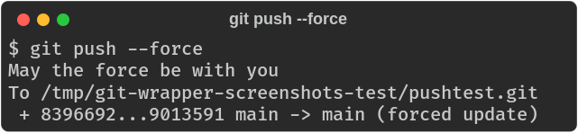

# Sample Plugins

Ready-to-use plugins for the git wrapper.

**Note:** Plugins are sourced (not executed) by the wrapper, so they run in the same shell environment and have access to wrapper variables and functions. The shebang line is for editor syntax highlighting only.

## Installation

Copy plugins to your `~/.git.d/` directory:

```bash
cp pre-process.d/commit_bashsyntaxcheck.sh ~/.git.d/pre-process.d/
cp post-process.d/commit_todo_check.sh ~/.git.d/post-process.d/
```

## Configuration

All plugins support `enabled` (default: `true`). Plugin-specific options use the format:

```bash
git config wrapper.plugin.<plugin_name>.<option> <value>
```

Or in `.gitconfig`:

```ini
[wrapper "plugin.commit_pyblack"]
    enabled = true
    mode = error
```

---

## Pre-process Plugins

### commit_bashsyntaxcheck.sh

Validate bash syntax with `bash -n` before commit. Checks `.sh` files and files with bash shebangs.

### commit_pyblack.sh

Run black on staged Python files.

| Option | Type | Default | Description |
|--------|------|---------|-------------|
| `mode` | string | `warn` | `warn` to show issues, `error` to block commit |

### commit_claude.sh

Set commit author and GPG options when run inside Claude Code (when `CLAUDECODE` env var is set).

### commit_noverify.sh

Warn or block `--no-verify` usage. Logs all bypass attempts to `~/.cache/git-wrapper/noverify.log`.

| Option | Type | Default | Description |
|--------|------|---------|-------------|
| `mode` | string | `warn` | `warn` to show warning, `strict` to block commit |


### commit_trailing_whitespace.sh

Check staged files for trailing whitespace and block commit if found. Provides sed commands to fix.

Detects text files via MIME type (text/*, application/json, application/x-python, etc.).

### clone_organize_dirs.sh

Organize cloned repos into `basedir/host/user/repo` structure.

| Option | Type | Default | Description |
|--------|------|---------|-------------|
| `basedir` | string | `~/git` | Base directory for organized repos |
| `force` | bool | `false` | Organize even when called from scripts |


---

## Post-process Plugins

### commit_todo_check.sh

Warn about TODOs in committed code.

| Option | Type | Default | Description |
|--------|------|---------|-------------|
| `regex` | string | `\bTODO:` | Pattern to match TODO comments |

### commit_wip_check.sh

Check for WIP markers in committed code.

| Option | Type | Default | Description |
|--------|------|---------|-------------|
| `regex` | string | `(#|//|\*).*\bWIP\b` | Pattern to match WIP comments |

### status_ignore_count.sh

Show count of ignored files after `git status`. Only runs in interactive sessions.

### push_jedi.sh

Print a blessing after force pushes (`--force`, `-f`, `--force-with-lease`, `--force-if-includes`). And also with you.



---

## Color Variables

Plugins should use the wrapper's color variables for any colored output. These are automatically configured based on `color.ui` and terminal detection—set when colors are appropriate, unset when output is piped or colors are disabled.

Since sourced plugins cannot detect whether the wrapper's output is being piped, using these variables ensures your plugin's colors follow git's color behavior automatically.

| Variable | Description |
|----------|-------------|
| `C_RED`, `C_GREEN`, `C_YELLOW`, etc. | Foreground colors |
| `S_BOLD`, `S_DIM`, `S_RESET` | Style modifiers |

```bash
# Variables are empty when colors disabled, so this is safe
echo "${C_RED}Error:${S_RESET} something went wrong"
```

---

## Message Helpers

For standardized warning/error messages, use these helper functions. They match git's output format and write to stderr:

| Function | Output |
|----------|--------|
| `warn "msg"` | `warning: msg` |
| `error "msg"` | `error: msg` |
| `fatal "msg"` | `fatal: msg` |

```bash
# Instead of custom error formatting
warn "file not found, skipping check"
error "invalid configuration value"
fatal "cannot continue without required dependency"
```

**Note:** These output plain text (no colors) to match git's native message style. Use color variables if you need more prominent formatting for user-facing notices.
